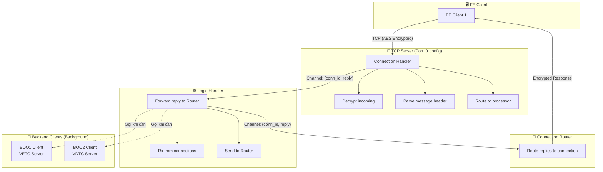
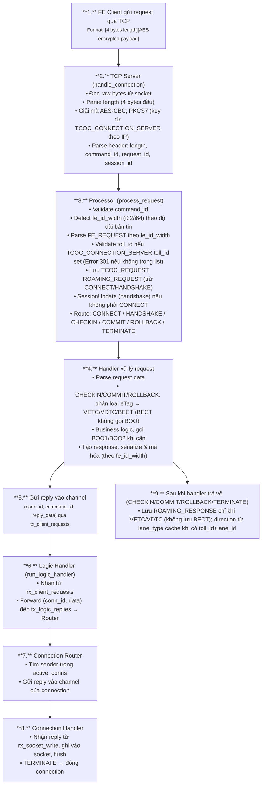
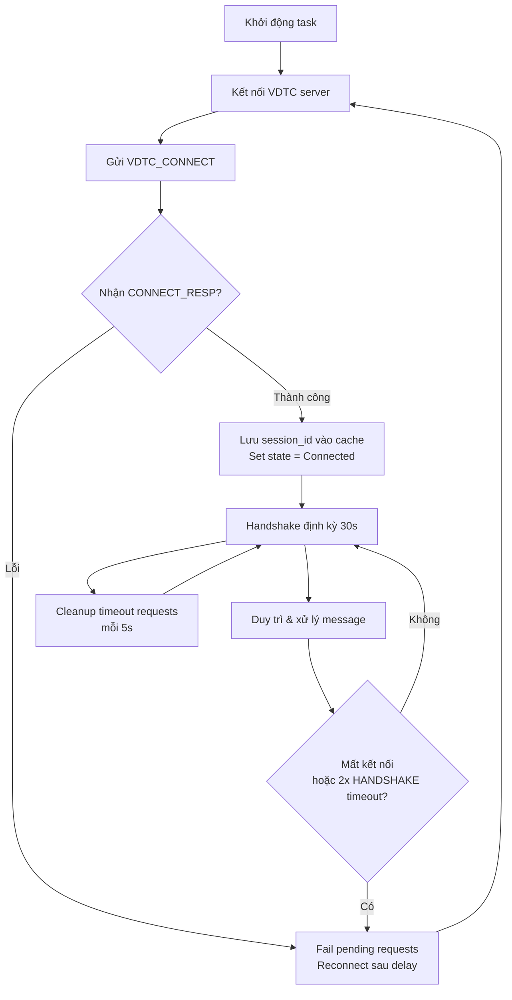
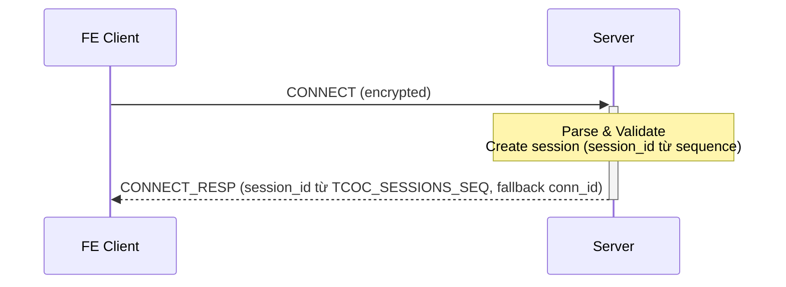
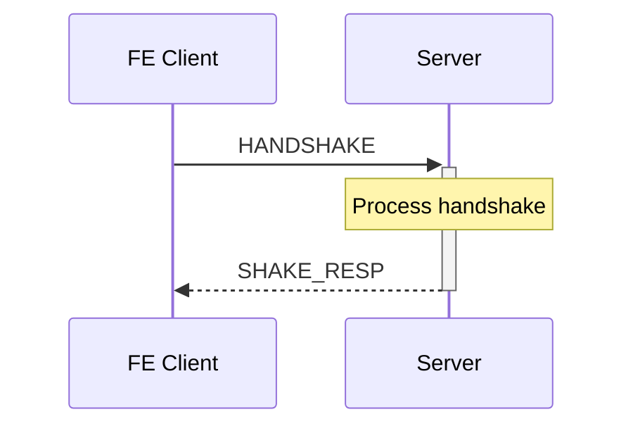
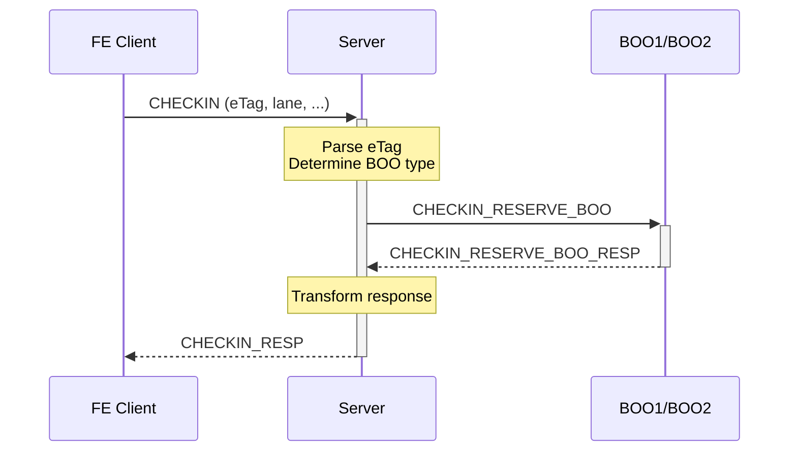
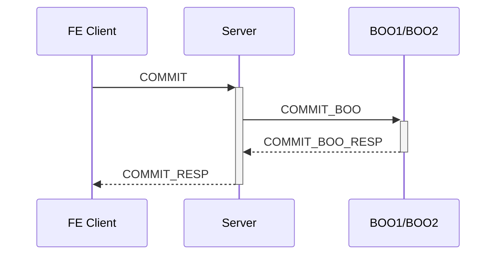
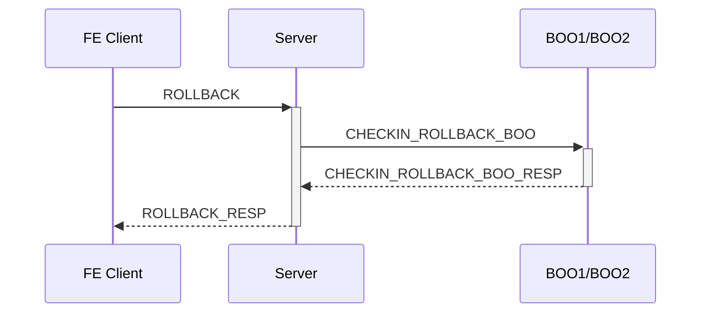
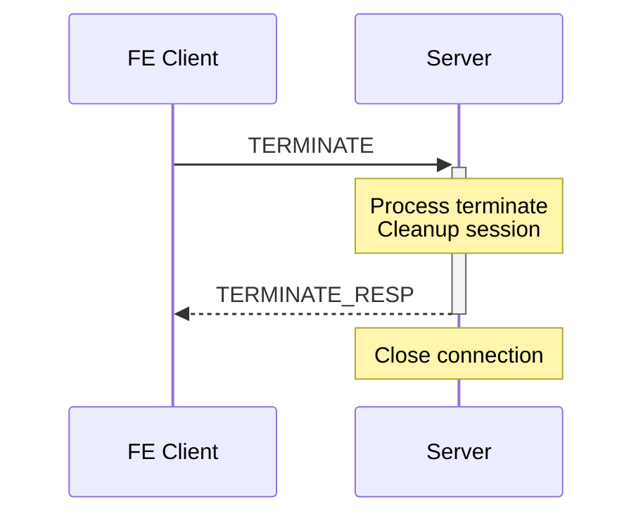

# Tài Liệu Mô Tả Luồng Xử Lý Dự Án

## 📋 Mục Lục

1. [Tổng Quan Dự Án](#tổng-quan-dự-án)
2. [Kiến Trúc Hệ Thống](#kiến-trúc-hệ-thống)
3. [Luồng Xử Lý Chính](#luồng-xử-lý-chính)
4. [Các Thành Phần Chính](#các-thành-phần-chính)
5. [Luồng Xử Lý Theo Từng Command](#luồng-xử-lý-theo-từng-command)
6. [Sơ đồ dạng text (fallback)](#-sơ-đồ-dạng-text-fallback)
7. [Cấu Hình và Biến Môi Trường](#cấu-hình-và-biến-môi-trường)
8. [Hướng Dẫn Cho Thành Viên Mới](#hướng-dẫn-cho-thành-viên-mới)
9. [Reconnect khi server restart](#-reconnect-khi-server-restart)
10. [BECT – Retry khi trừ tiền lỗi](#-bect--retry-khi-trừ-tiền-lỗi)
11. [Các trường datetime (checkin/checkout)](#-các-trường-datetime-checkin--checkout--bect-vetc-vdtc)
12. [Lịch sử phiên bản (Changelog)](#-lịch-sử-phiên-bản-changelog)

---

## 🎯 Tổng Quan Dự Án

**Rust-core-transaction** là một hệ thống middleware xử lý giao dịch thu phí điện tử (ETC - Electronic Toll Collection) được viết bằng Rust. Hệ thống đóng vai trò là gateway trung gian giữa các Front-End (FE) clients và hai hệ thống backend:

- **VETC (BOO1)**: Hệ thống thu phí điện tử VETC
- **VDTC (BOO2)**: Hệ thống thu phí điện tử VDTC

### Chức Năng Chính

- Nhận và xử lý các request từ FE clients qua TCP
- Mã hóa/giải mã dữ liệu bằng AES-CBC với PKCS7 padding
- Định tuyến request đến đúng backend system (VETC hoặc VDTC) dựa trên eTag prefix
- Quản lý kết nối và session với các backend systems
- Xử lý các giao dịch: CONNECT, HANDSHAKE, CHECKIN, COMMIT, ROLLBACK, TERMINATE

---

## 🏗️ Kiến Trúc Hệ Thống

### Sơ Đồ Kiến Trúc

*GitLab (bản mới) và GitHub đều hỗ trợ Mermaid — sơ đồ sẽ tự render. Nếu bạn xem file ở nơi không render được (raw, email, terminal), xem [Sơ đồ dạng text (fallback)](#-sơ-đồ-dạng-text-fallback) ở cuối tài liệu.*



### Các Task Chạy Song Song

Hệ thống sử dụng **Tokio async runtime** với 5 task chạy song song:

1. **TCP Server Task**: Lắng nghe và chấp nhận kết nối từ FE clients
2. **Connection Router Task**: Định tuyến response từ Logic Handler về đúng connection
3. **Logic Handler Task**: Nhận reply (conn_id, data) từ connection handler qua rx_client_requests và forward sang Connection Router qua tx_logic_replies (business logic thực tế chạy trong handle_connection khi gọi process_request)
4. **BOO1 Client Task**: Duy trì kết nối với VETC server
5. **BOO2 Client Task**: Duy trì kết nối với VDTC server

---

## 🔄 Luồng Xử Lý Chính

### 1. Khởi Động Hệ Thống (`main.rs`)

```text
1. Khởi tạo logging (file logger, cleanup task, panic hook)
2. Load configuration từ environment variables
3. Khởi tạo database pools (RATING_DB, MEDIATION_DB, CRM_DB) — tùy chọn, không panic nếu lỗi
4. Khởi tạo cache (Moka + KeyDB). Load **RATING cache** (TOLL, TOLL_LANE, PRICE, **closed_cycle_transition_stage** (CLOSED_CYCLE_TRANSITION_STAGE + TOLL_STAGE), TOLL_FEE_LIST, SUBSCRIPTION_HISTORY). **Thứ tự load**: Ưu tiên DB; khi KeyDB kết nối thì nếu DB lỗi mới fallback đọc từ KeyDB (ghi vào Moka, không ghi ngược KeyDB). Reload định kỳ: ưu tiên DB, thành công ghi Moka + KeyDB; DB lỗi/không có pool thì fallback KeyDB (load_from_keydb = true).
5. Bắt đầu task reload cache định kỳ (CACHE_RELOAD_INTERVAL_SECONDS): reload RATING cache (toll, lane, price, closed_cycle_transition_stage, toll_fee_list, subscription_history) và **connection cache (server, user)** khi mediation_pool_holder có pool.
6. Load **connection data cache** (TCOC_CONNECTION_SERVER, TCOC_USER từ MEDIATION) sau khi reload task đã start; khởi chạy **db_retry task** (DB_RETRY_INTERVAL_SECONDS, dùng mediation_pool_holder) và **DB init retry task** (MEDIATION: định kỳ create_pool("MEDIATION"), khi thành công set mediation_holder và load lại connection cache).
7. ETDR: start_etdr_db_retry_task (ETDR_RETRY_INTERVAL_SECONDS, ETDR_MAX_RETRY_COUNT; key theo ticket_id nếu set ETDR_RETRY_KEY_PREFIX); mỗi chu kỳ một bản ghi, lock → ghi DB → cập nhật KeyDB/bộ nhớ → release (HA-safe). start_cache_cleanup_task (ETDR_CLEANUP_INTERVAL_SECONDS)
8. Khởi tạo Kafka producer (tùy chọn): nếu KAFKA_BOOTSTRAP_SERVERS được set thì Kafka init trong background (retry khi lỗi). Nếu consumer_enabled thì spawn run_checkin_hub_consumer: consume topic KAFKA_TOPIC_CHECKIN_HUB_ONLINE (CHECKIN_HUB_INFO), lấy danh sách partition hợp lệ từ metadata (get_valid_partitions), load offset từ KAFKA_CONSUMER_OFFSET_FILE (nếu có), fetch → parse JSON → cập nhật hub_id trong BOO_TRANSPORT_TRANS_STAGE hoặc TRANSPORT_TRANSACTION_STAGE theo ticket_in_id
9. Tạo channels:
   - tx_client_requests / rx_client_requests: FE requests → Logic Handler
   - tx_logic_replies / rx_logic_replies: Logic Handler → Connection Router
10. Khởi tạo shared state:
   - active_conns: Map lưu sender của từng connection
   - boo1_client, boo2_client: Shared reference đến BOO1/BOO2 client
   - session_map (trong TCP server): session_id → (conn_id, last_received_time) cho handshake timeout
11. Spawn tasks: TCP Server, Connection Router, Logic Handler, BOO1 Client, BOO2 Client
12. Graceful shutdown: đợi SIGINT/SIGTERM, sleep 2s rồi thoát
```

### 2. Luồng Xử Lý Request Từ FE Client

**Khi chấp nhận kết nối mới (trước khi đọc request đầu tiên)**:

- Tra cứu `TCOC_CONNECTION_SERVER` theo **IP client** → lấy `toll_id` (chuỗi trạm cho phép, có thể null) và `encryption_key`.
- Nếu không có `encryption_key` → đóng kết nối ngay (không gửi TERMINATE_RESP), log Error 301.
- Lưu `encryption_key` theo `conn_id` trong map (dùng cho mọi request của connection và cho TERMINATE_RESP khi handshake timeout); khi connection đóng thì xóa qua `EncryptionKeyGuard`.



### 3. Luồng Kết Nối Với Backend Systems

#### BOO1 Client (VETC)


**Chi tiết luồng**:

1. **Connection State**: Disconnected → Connecting → Connected (double-check để tránh race condition)
2. **Session ID**: Lưu vào `AtomicI64` cache để đọc lock-free, update khi nhận CONNECT_RESP
3. **Pending Requests**: HashMap với oneshot channel, timeout 30s, cleanup mỗi 5s
4. **send_and_wait**: Kiểm tra `is_connected()` → lock state → double-check → register pending → gửi message → chờ response (timeout 10s)
5. **Reconnection**: Trigger khi mất kết nối hoặc 2 lần HANDSHAKE timeout liên tiếp, fail tất cả pending requests
6. **Handshake**: Task riêng, gửi mỗi 30s, track consecutive timeouts, abort khi reconnect

#### BOO2 Client (VDTC)



**Chi tiết luồng**: Tương tự BOO1 client (connection state, session ID cache, pending requests, reconnection, handshake)

### 4. Luồng Kafka (tùy chọn)

Khi `KAFKA_BOOTSTRAP_SERVERS` được cấu hình:

**Producer (checkin/checkout lên HUB):**

- **Checkin**: Sau khi CHECKIN commit thành công (VETC/VDTC), handler gọi `get_kafka_producer()` → nếu có, build `CheckinCommitPayload` từ ETDR/BOO_TRANSPORT_TRANS_STAGE rồi gọi `send_checkin_from_commit_background(payload)`. Event được đẩy vào hàng đợi (không block); worker task build `CheckinEvent` (CHECKIN_INFO) và gửi batch lên topic `topic_trans_hub_online`.
- **Checkout**: Sau khi COMMIT checkout thành công (VETC/VDTC), handler tương tự gọi `send_checkout_from_commit_background(payload)` → worker build `CheckoutEvent` (CHECKOUT_INFO), gửi batch lên cùng topic `topic_trans_hub_online`.
- **Hàng đợi**: Giới hạn `KAFKA_QUEUE_CAPACITY`; khi đầy thì bỏ event cũ nhất (drop oldest). Worker drain theo batch (`KAFKA_SEND_BATCH_SIZE`), gửi một round-trip per topic.
- **Retry**: Gửi lên Kafka có retry + exponential backoff; sau 3 lần timeout liên tiếp thì yêu cầu reconnect (một task reconnect_loop xử lý); liveness check định kỳ (nếu bật) phát hiện Kafka down/restart và reconnect.
- **Graceful shutdown**: Khi nhận SIGINT/SIGTERM, process sleep 2s rồi thoát; hàng đợi Kafka **không** được drain — events còn trong queue sẽ mất. Cần shutdown “đủ chậm” hoặc giảm tải trước khi tắt nếu cần đảm bảo không mất event.

---

**Consumer (nhận CHECKIN_HUB_INFO từ HUB):** Khi `KAFKA_CONSUMER_ENABLED` bật: spawn `run_checkin_hub_consumer`. Topic: `KAFKA_TOPIC_CHECKIN_HUB_ONLINE`. Lấy partition hợp lệ từ metadata (`get_valid_partitions`). Offset từ `KAFKA_CONSUMER_OFFSET_FILE`. Bản tin CHECKIN_HUB_INFO (hub_id, ticket_in_id) → cập nhật hub_id vào BOO_TRANSPORT_TRANS_STAGE (VETC/VDTC) hoặc TRANSPORT_TRANSACTION_STAGE (BECT).

---

## 🧩 Các Thành Phần Chính

### 1. Network Layer (`src/network/`)

#### `server.rs` - TCP Server

- **Chức năng**: Lắng nghe và chấp nhận kết nối TCP từ FE clients; tra cứu cấu hình theo IP; quản lý encryption_key và handshake timeout.
- **Nhiệm vụ**:
  - Bind TCP listener trên port được cấu hình
  - Tạo connection ID duy nhất cho mỗi kết nối (log có conn_id khi new connection / connection closed)
  - **Denylist (IP_DENYLIST)**: Trước khi chấp nhận kết nối, nếu IP client khớp pattern (10.10.10.10, 10.10.*, 10.*) thì từ chối ngay (drop socket), không ghi log. Pattern biên dịch một lần (`CompiledIpDenylist`).
  - **IP block (IP_BLOCK_ENABLED)**: Khi bật, bộ đếm lỗi theo IP (in-memory); trạng thái block chỉ lưu Redis/KeyDB. Sau N lỗi (IP_BLOCK_FAILURE_THRESHOLD, mặc định 5) → block IP trong IP_BLOCK_DURATION_SECONDS (mặc định 900 = 15 phút). Lỗi kết nối (đóng lỗi, handshake timeout) đều tính; khi Redis/KeyDB lỗi → fail-open (cho phép kết nối). `IpBlockService` (services/ip_block_service).
  - Khi accept connection: tra cứu `TCOC_CONNECTION_SERVER` theo **client IP** → lấy `toll_id` (Option<String>, chuỗi trạm cho phép) và `encryption_key`. Nếu không có encryption_key → đóng kết nối ngay (Error 301), không gửi TERMINATE_RESP.
  - Lưu `encryption_key` theo conn_id trong `EncryptionKeyMap`; khi connection kết thúc thì xóa qua `EncryptionKeyGuard`.
  - Spawn task riêng cho mỗi connection (`handle_connection`); mỗi request gọi `process_request(..., toll_id, ..., encryption_key_str)` (toll_id và key từ bước tra cứu).
  - Handshake timeout: task định kỳ kiểm tra session; nếu sau CONNECT mà quá thời gian không nhận HANDSHAKE thì gửi TERMINATE_RESP (status ERROR_HANDSHAKE_TIMEOUT) và đóng connection (dùng encryption_key từ map).
  - Quản lý lifecycle của connections (active_conns, read timeout, idle timeout, dead connection check).

#### `router.rs` - Connection Router

- **Chức năng**: Định tuyến response từ Logic Handler về đúng connection
- **Nhiệm vụ**:
  - Nhận reply từ Logic Handler qua channel
  - Tìm sender của connection trong `active_conns`
  - Gửi reply vào channel của connection đó

#### `boo1_client.rs` - VETC Client

- **Chức năng**: Quản lý kết nối với VETC server
- **Nhiệm vụ**:
  - Kết nối và duy trì connection với VETC
  - Gửi CONNECT và HANDSHAKE messages
  - Quản lý message queue với request/response matching
  - Auto-reconnect khi mất kết nối
- **Chi tiết kỹ thuật**:
  - **Connection State**: Quản lý trạng thái kết nối (Disconnected, Connecting, Connected) với double-check để tránh race condition
  - **Session ID Cache**: Dùng `AtomicI64` để đọc session_id lock-free, tránh block khi state Mutex đang bận
  - **Pending Requests**: HashMap lưu pending requests với oneshot channel, timeout 30s, cleanup mỗi 5s
  - **send_and_wait**: Kiểm tra connection state trước khi gửi, double-check sau khi lock, timeout 10s để trả lỗi sớm cho FE
  - **Reconnection**: Task riêng biệt, trigger khi mất kết nối hoặc 2 lần HANDSHAKE timeout liên tiếp
  - **Handshake**: Định kỳ 30s, track consecutive timeouts, abort task khi reconnect
  - **Message Forwarding**: Forward messages từ main channel đến current writer channel để handle backpressure

#### `boo2_client.rs` - VDTC Client

- **Chức năng**: Quản lý kết nối với VDTC server
- **Nhiệm vụ**: Tương tự BOO1 client nhưng cho VDTC
- **Chi tiết kỹ thuật**: Giống BOO1 client (connection state, session ID cache, pending requests, reconnection, handshake)

#### Chi Tiết Kỹ Thuật BOO1/BOO2 Client

**1. Connection State Management**

- **States**: `Disconnected` → `Connecting` → `Connected`
- **Double-check pattern**: Trong `send_and_wait()`, kiểm tra `is_connected()` trước khi lock, sau đó double-check connection state sau khi lock để tránh race condition khi connection đóng trong lúc unlock
- **Session ID Cache**: Dùng `Arc<AtomicI64>` để đọc lock-free (`get_session_id()`, `is_connected()`), update khi nhận CONNECT_RESP
- **State transitions**:
  - `Disconnected` → `Connecting`: Khi bắt đầu kết nối
  - `Connecting` → `Connected`: Khi nhận CONNECT_RESP thành công
  - `Connected` → `Disconnected`: Khi mất kết nối hoặc reconnect

**2. Pending Requests Management**

- **Storage**: `HashMap<RequestId, PendingRequestInfo>` trong `Boo1ClientState`/`Boo2ClientState`
- **PendingRequestInfo**: Chứa `command_id`, `timestamp`, `response_tx` (oneshot channel)
- **Registration**: `register_pending()` - cảnh báo nếu request_id trùng (overwrite entry cũ)
- **Response handling**: `handle_response()` - match request_id, gửi response qua oneshot channel
- **Timeout**: 30 giây, cleanup mỗi 5 giây (`cleanup_timeout_requests()`)
- **Fail all**: `fail_all_pending()` - khi connection đóng, fail tất cả pending requests để tránh block FE chờ timeout

**3. send_and_wait() Flow**

```text
1. Kiểm tra is_connected() (lock-free, đọc từ session_id_cache)
2. Nếu không connected → return error ngay
3. Tạo oneshot channel (response_tx, response_rx)
4. Lock state → double-check connection state
5. Nếu không connected → return error, không đăng ký pending
6. Đăng ký pending request (register_pending)
7. Kiểm tra lại is_connected() trước khi gửi
8. Nếu không connected → remove pending, return error
9. Gửi message qua tx_outgoing channel
10. Chờ response với timeout 10s
11. Xử lý kết quả: Ok(message) / Err(timeout) / Err(channel closed)
```

**4. Reconnection Logic**

- **Reconnect task**: Task riêng biệt, chạy trong loop
- **Triggers**:
  - Mất kết nối (read/write error)
  - 2 lần HANDSHAKE timeout liên tiếp (`HANDSHAKE_TIMEOUT_RECONNECT_THRESHOLD = 2`)
- **Process**:
  1. Signal qua `tx_reconnect` channel
  2. Đợi delay (config: `DELAY_TIME_RECONNECT_VETC`/`VDTC`)
  3. Set state = `Connecting`, clear session_id_cache
  4. Kết nối TCP, gửi CONNECT
  5. Nhận CONNECT_RESP, update session_id và state = `Connected`
  6. Fail tất cả pending requests cũ (nếu có)
  7. Abort handshake task cũ (nếu có)
  8. Khởi động lại reader/writer tasks và handshake task

**5. Handshake Logic**

- **Interval**: 30 giây (`SECOND_DELAY_HANDSHAKE_VETC`/`VDTC`)
- **Task**: Task riêng biệt, spawn sau khi CONNECT thành công
- **Timeout**: 10 giây cho mỗi HANDSHAKE request
- **Consecutive timeouts**: Track số lần timeout liên tiếp, reset khi nhận HANDSHAKE_RESP
- **Reconnect trigger**: Khi đạt threshold (2 lần), signal reconnect task
- **Abort**: Khi reconnect, abort handshake task cũ để tránh duplicate

**6. Message Forwarding**

- **Main channel**: `tx_outgoing` / `rx_outgoing` (capacity 128)
- **Current writer channel**: `current_writer_tx` (Option<mpsc::Sender>) - update mỗi lần reconnect
- **Forward task**: Forward messages từ main channel đến current writer channel
- **Backpressure**: Handle khi current writer channel đầy hoặc None (connection đóng)

**7. Error Handling**

- **Connection not established**: Return `NotConnected` error ngay, không đăng ký pending
- **Connection closed during send**: Remove pending request, return `NotConnected` error
- **Timeout**: Remove pending request, return `TimedOut` error (10s)
- **Channel closed**: Kiểm tra connection state, return `BrokenPipe` error
- **Cleanup timeout**: Background task cleanup requests > 30s, gửi timeout error qua oneshot channel

### 2. Handlers (`src/handlers/`)

#### `processor.rs` - Request Router

- **Chức năng**: Route request đến handler tương ứng dựa trên command_id; validate toll_id; lưu TCOC_REQUEST, ROAMING_REQUEST/ROAMING_RESPONSE; cập nhật session (handshake).
- **Đầu vào từ connection**: `encryption_key` (từ TCOC_CONNECTION_SERVER theo IP), `db_toll_id` (Option<String> — chuỗi trạm cho phép, dạng "1000-1009,1010,1015-1020"; nếu set thì request phải có toll_id nằm trong list, không thì trả Error 301).
- **fe_protocol**: `detect_fe_id_width(command_id, data.len())` → I32 hoặc I64; parse request_id/session_id và body offsets theo fe_id_width; response serialize theo cùng fe_id_width (FE gửi i32 → trả i32, gửi i64 → trả i64).
- **Trước khi dispatch**: Lưu TCOC_REQUEST; với mọi command trừ CONNECT/HANDSHAKE → lưu ROAMING_REQUEST chỉ khi VETC/VDTC (không lưu BECT). Nếu không phải CONNECT → gửi SessionUpdate (handshake). Validate toll_id với `is_toll_id_valid` khi db_toll_id có giá trị.
- **Sau khi handler trả về**: CHECKIN/COMMIT/ROLLBACK/TERMINATE → lưu ROAMING_RESPONSE **chỉ khi VETC hoặc VDTC** (BECT không lưu). CHECKIN/COMMIT/ROLLBACK dùng `save_roaming_response_with_direction` (direction từ lane_type cache: "1"=I, "2"=O); TERMINATE dùng `save_roaming_response_if_applicable` (direction mặc định O).
- **Command mapping**:
  - `0x00` (CONNECT) → `handle_connect`
  - `0x02` (HANDSHAKE) → `handle_handshake`
  - `0x04` (CHECKIN) → `handle_checkin` → (response, status) → save ROAMING_RESPONSE nếu VETC/VDTC
  - `0x06` (COMMIT) → `handle_commit` → (response, status) → save ROAMING_RESPONSE nếu VETC/VDTC
  - `0x08` (ROLLBACK) → `handle_rollback` → (response, status) → save ROAMING_RESPONSE nếu VETC/VDTC
  - `0x0A` (TERMINATE) → `handle_terminate` → (response, status) → save ROAMING_RESPONSE nếu VETC/VDTC

#### `connect.rs` - CONNECT Handler

- **Chức năng**: Xử lý request kết nối từ FE client; xác thực user/pass (trừ khi CONNECT_BYPASS_AUTH); tạo session trong DB; đăng ký session với Connection Router (handshake timeout).
- **Luồng**:
  1. Parse FE_CONNECT (format 44 bytes i32 hoặc 52 bytes i64 cho request_id/session_id)
  2. Validate credentials: TcocUserService.get_by_username_and_toll_id (password hash SHA1+base64); nếu sai → FE_CONNECT_RESP status 301
  3. Lấy session_id từ sequence MEDIATION_OWNER.TCOC_SESSIONS_SEQ (fallback conn_id nếu lỗi)
  4. Lưu TCOC_SESSION (TcocSessionService.save)
  5. Gửi SessionUpdate::Insert (session_id, conn_id) để Logic Handler đăng ký session (handshake timeout)
  6. Tạo FE_CONNECT_RESP (session_id = giá trị từ sequence), mã hóa theo fe_id_width và trả về
  7. Lưu TCOC_RESPONSE (CONNECT_RESP)

#### `handshake.rs` - HANDSHAKE Handler

- **Chức năng**: Xử lý handshake request
- **Luồng**: Tương tự CONNECT, tạo FE_SHAKE_RESP

#### `checkin/` - CHECKIN Handler

- **Chức năng**: Xử lý checkin transaction; phân loại theo eTag (VETC/VDTC/BECT); BECT không gọi BOO.
- **Cấu trúc**: `checkin/mod.rs`, `checkin/common.rs`, `checkin/bect.rs`, `checkin/vetc/` (mod.rs, handler.rs, boo_stage.rs, messages.rs), `checkin/vdtc/` (mod.rs, handler.rs, boo_stage.rs, messages.rs)
- **Luồng**:
  1. Parse FE_CHECKIN request (theo fe_id_width: 98 bytes i32 hoặc 106 bytes i64)
  2. Lấy TOLL và TOLL_LANE từ cache (get_toll_with_fallback, get_toll_lanes_by_toll_id_with_fallback); nếu không tìm thấy trạm/làn → FE_CHECKIN_RESP status 301 (NOT_FOUND_STATION_LANE)
  3. Validate lane_type ("1"=vào, "2"=ra); không hợp lệ → 301
  4. Xác định loại eTag: `Config::get_vehicle_boo_type(etag)` — prefix trong BOOX1_PREFIX_LIST → 1 (VETC), trong BOOX2_PREFIX_LIST → 2 (VDTC), còn lại → 3 (BECT)
  5. Gọi handler tương ứng: VETC → vetc::handle_vetc_checkin (BOO1, trong vetc/handler.rs), VDTC → vdtc::handle_vdtc_checkin (BOO2, trong vdtc/handler.rs), BECT → bect::handle_bect_checkin (không gọi BOO, xử lý nội bộ)
  6. Tạo FE_CHECKIN_RESP, serialize & mã hóa theo fe_id_width, trả về (response, status)
- **Lấy bản ghi checkIn cho checkout (out)**: Từ **cache + DB** (sync + bảng chính BOO/BECT) qua `find_latest_by_etag` và `get_best_pending_from_sync_or_main_boo` / `get_best_pending_from_sync_or_main_bect`; nếu bản ghi đã checkout thì trả lỗi.
- **BECT checkout (out lane)**:
  - Kiểm tra tài khoản (subscriber tồn tại, account_id > 0, account active) và số dư (available_balance >= trans_amount); có thể **bypass** bằng env `BECT_SKIP_ACCOUNT_CHECK` (1/true/yes). Có thể bật kiểm tra **số dư tối thiểu** (min balance). Khi lỗi vẫn ghi DB (ETDR + Stage + TCD) rồi mới trả lỗi.
  - Khi account_id > 0 và trans_amount > 0: insert bản ghi **ACCOUNT_TRANSACTION** (reserve, AUTOCOMMIT=2 PENDING_COMMIT, AUTOCOMMIT_STATUS null); trả về ACCOUNT_TRANSACTION_ID lưu vào TRANSPORT_TRANSACTION_STAGE.ACCOUNT_TRANS_ID.

#### `commit/` - COMMIT Handler

- **Chức năng**: Xử lý commit transaction; phân loại theo eTag (VETC/VDTC/BECT); BECT không gọi BOO.
- **Cấu trúc**: `commit/mod.rs`, `commit/common.rs` (get_boo_record_with_retry — retry lấy BOO record với constants commit_retry::MAX_RETRIES, INITIAL_RETRY_DELAY_MS), `commit/bect/` (mod.rs, handler.rs), `commit/vetc/` (mod.rs, handler.rs, messages.rs), `commit/vdtc/` (mod.rs, handler.rs, messages.rs)
- **Luồng**: Parse FE_COMMIT → get_vehicle_boo_type(etag) → VETC/VDTC/BECT dùng `get_boo_record_with_retry()` (từ common) để lấy bản ghi với retry; VETC/VDTC gửi COMMIT_BOO đến BOO1/BOO2; BECT xử lý nội bộ. Trả về (response, status).
- **BECT commit (out lane)**:
  - Kiểm tra tài khoản/số dư (có thể bypass bằng `BECT_SKIP_ACCOUNT_CHECK`). Luôn ghi DB rồi mới trả lỗi.
  - Cập nhật **ACCOUNT_TRANSACTION**: lấy bản ghi theo ACCOUNT_TRANS_ID; nếu `allow_commit_or_rollback` (AUTOCOMMIT=2, AUTOCOMMIT_STATUS null) thì gọi `update_account_transaction_commit_status` — SUCC: AUTOCOMMIT_STATUS=1 (COMMIT), NEW_BALANCE/NEW_AVAILABLE_BAL trừ amount; FALL: AUTOCOMMIT_STATUS=2 (ROLLBACK), khôi phục OLD_*.

#### `rollback/` - ROLLBACK Handler

- **Chức năng**: Xử lý rollback transaction; phân loại theo eTag (VETC/VDTC/BECT); BECT không gọi BOO.
- **Cấu trúc**: `rollback/mod.rs`, `rollback/common.rs`, `rollback/vetc.rs`, `rollback/vdtc.rs`, `rollback/bect.rs` (file đơn, chưa tách module con)
- **Luồng**: Parse FE_ROLLBACK → get_vehicle_boo_type(etag) → VETC/VDTC gửi CHECKIN_ROLLBACK_BOO đến BOO1/BOO2; BECT xử lý nội bộ. Trả về (response, status).

#### `terminate.rs` - TERMINATE Handler

- **Chức năng**: Xử lý terminate connection
- **Luồng**: Tạo TERMINATE_RESP và đóng connection sau khi gửi

### 3. Logic Layer (`src/logic/`)

#### `handler.rs` - Logic Handler

- **Chức năng**: Task nhận reply đã xử lý từ connection handler và forward tới Connection Router
- **Luồng thực tế**: `run_logic_handler` nhận `IncomingMessage` (conn_id, command_id, data) từ rx_client_requests — trong đó `data` là **reply bytes** đã được process_request tạo ra trong handle_connection. Logic Handler chỉ gửi (conn_id, data) sang tx_logic_replies để Router đẩy về đúng connection. Toàn bộ business logic (parse, validate, handler, build response) chạy trong `process_request` tại connection task, không chạy trong Logic Handler task.

### 4. FE Protocol và Models

- **fe_protocol.rs**: Giao thức FE hỗ trợ hai độ rộng ID: **i32** (4 bytes request_id/session_id/ticket_id) và **i64** (8 bytes). `detect_fe_id_width(command_id, data_len)` xác định từ độ dài bản tin; parse và serialize request/response theo `FeIdWidth` (FE gửi i32 → trả i32, gửi i64 → trả i64). Có bảng layout byte theo từng command (CONNECT, HANDSHAKE, CHECKIN, COMMIT, ROLLBACK).
- **types.rs**: `FeIdWidth` (I32/I64), `SessionUpdate`, `ConnectionId`, `IncomingMessage`, …
- **TCOCmessages.rs**: Message structures cho Front-End protocol
- **VETCmessages.rs**, **VDTCmessages.rs**: Message structures cho VETC/VDTC protocol (timestamp, trans_datetime, commit_datetime là epoch **millisecond**)
- **ETDR/** (mod.rs, types_impl, cache, sync): Cấu trúc dữ liệu ETDR (các trường datetime epoch **millisecond**)
- **TollCache.rs**: Cache cho TOLL và TOLL_LANE data
- **hub_events.rs**: Cấu trúc event gửi lên Kafka/Hub — `CheckinEvent`/`CheckinEventData`, `CheckoutEvent`/`CheckoutEventData` (CHECKIN_INFO, CHECKOUT_INFO)

### 5. Cache (`src/cache/`)

- **config/**: CacheManager, KeyDB (Redis), MokaCache, cache_prefix
- **data/**: toll_cache, toll_lane_cache, price_cache, **closed_cycle_transition_stage_cache** (CLOSED_CYCLE_TRANSITION_STAGE + TOLL_STAGE; segment maps (toll_a, toll_b) chuẩn hóa → cycle_id và stage_id; `get_segment_cycle_id`, `get_stage_id_for_segment`, `get_toll_a_toll_b_for_stage_id`, `get_segments_for_leg` dùng cho WB/subscription và tính phí theo đoạn), toll_fee_list_cache, subscription_history_cache, **connection_data_cache** (TCOC_CONNECTION_SERVER, TCOC_USER từ MEDIATION — dùng khi accept connection tra cứu IP → toll_id, encryption_key), **db_retry** (hàng đợi ghi DB qua KeyDB: session FIFO; conn_server/user theo key, ghi đè bản mới nhất; buffer in-memory khi KeyDB fail, task retry flush khi KeyDB có lại; dùng mediation_pool_holder), **wb_route_cache**, **ex_list_cache**, **ex_price_list_cache**, cache_reload task, **dto/** (price_dto, toll_lane_dto, subscription_history_dto, wb_list_route_dto, ex_list_dto, ex_price_list_dto)

### 6. Logging (`src/logging/`)

- **file_logger.rs**: Ghi log ra file theo cấu hình. Khi **LOG_DEBUG_FILE**=1|true|yes: tạo file `*-debug-*.log` và ghi mọi log mức debug trở lên (registry dùng filter debug/trace); mặc định tắt (không tạo file debug, registry dùng LOG_LEVEL từ env). **LOG_NODE_ID**: tùy chọn, nếu không set thì dùng 6 ký tự hex ngẫu nhiên; suffix file log `{type}-{node_id}` để phân biệt instance. Rotation theo kích thước, cắt file chính sau copy. Rotation và cleanup áp dụng cho file debug khi bật.
- **cleanup.rs**: Tự động xóa file log cũ (retention theo ngày); **statistics_retention_days** (main đặt 90 ngày) cho file thống kê.
- **statistics** (logs/statistics/): Ghi thống kê ra thư mục `logs/statistics/` (file theo ngày, suffix `{node_id}`). **rct-db-time**: thời gian thao tác DB — mỗi dòng: `<timestamp>   <OP>   <table>   <detail>   <elapsed_ms>` (OP = GET/INSERT/UPDATE/DELETE; table = TRANSPORT_TRANSACTION_STAGE hoặc BOO_TRANSPORT_TRANS_STAGE; detail = id bản ghi hoặc "by_etag"/"by_ticket_in_id", dễ lọc theo bảng/loại truy vấn và theo dõi độ trễ). **rct-db-retries**: ghi lần retry ETDR sync (raw_content, success/error). Cleanup xóa file statistics cũ theo statistics_retention_days.

### 7. Services (`src/services/`)

- **tcoc_session_service**, **tcoc_request_service**, **tcoc_response_service**, **tcoc_user_service**, **tcoc_connection_server_service**: TCOC và session/request/response
- **boo_transport_trans_stage_service**: Service BOO_TRANSPORT_TRANS_STAGE với cache-aside pattern. Khi save/update ghi thêm bản ghi lịch sử vào **BOO_TRANSPORT_TRANS_STAGE_H** (ACTION_TYPE I/U). Verify sau save dùng `verify_after_save_service` (MAX_RETRIES, exponential backoff). **Ticket_id**: BECT và BOO dùng chung **TicketIdService** — lấy ticket_id từ block prefix+suffix (sequence DB + counter 1..suffix_max, prefetch khi đạt ngưỡng); nếu DB failed thì fallback `utils::generate_ticket_id_async()`. Id từ block không kiểm tra trùng; retry chỉ khi ticket_id = 0.
- **transport_transaction_stage_service**: Service TRANSPORT_TRANSACTION_STAGE với cache-aside pattern. **Ticket_id**: Dùng chung TicketIdService (get_next_ticket_id_for_checkin), sequence TRANSPORT_TRANS_STAGE_SEQ (BECT) hoặc block chung với BOO; fallback `generate_ticket_id_async()`.
- **ticket_id_service**: Singleton **TicketIdService** — tạo ticket_id dùng chung cho BECT và BOO. Luồng: sequence DB một lần làm prefix, counter 1..suffix_max (ENV TICKET_ID_SUFFIX_MAX), khi đạt TICKET_ID_PREFETCH_THRESHOLD thì prefetch sequence tiếp theo; id = prefix * suffix_multiplier + suffix; không kiểm tra trùng khi dùng id từ block. Nếu DB failed thì fallback `utils::generate_ticket_id_async()`. Retry chỉ khi ticket_id = 0.
- **transport_trans_stage_tcd_service**: Giai đoạn vận tải và giao dịch TCD. Khi insert/update BOO_TRANS_STAGE_TCD ghi thêm **BOO_TRANS_STAGE_TCD_HIS** (lịch sử).
- **ip_block_service**: Quản lý block IP: bộ đếm lỗi in-memory theo IP, trạng thái block chỉ lưu Redis/KeyDB. Dùng khi client kết nối lỗi quá ngưỡng (handshake/config/decrypt); block theo IP_BLOCK_DURATION_SECONDS; Redis lỗi → fail-open.
- **toll_fee** (module): Tính phí cầu đường (rating từ cache/DB, subscription, price_ticket_type, closed_cycle_transition_stage_cache; hỗ trợ WB/Ex list theo BOO). Cấu trúc: **error** (TollFeeError), **types** (TollFeeListContext, ParsedBoo, SegmentInfo, FeeCalculationContext, RatingDetailBuilder), **helpers** (so khớp BOO, hiệu lực subscription/price, white/black/subscription theo đoạn), **detail** (tạo RatingDetail: whitelist, subscription, regular), **segment** (giá theo đoạn, merge route thành segments, BOO từ TOLL), **direct_price** (tính phí direct price: cùng trạm, nhiều đoạn, phân bổ), **flow** (luồng resolve direct price, same station, segment loop, no route), **service** (TollFeeService và calculate_toll_fee).
- **Tính phí theo đoạn**: Module toll_fee dùng **closed_cycle_transition_stage_cache** (segment maps từ TOLL_STAGE): `get_segment_cycle_id`, `get_stage_id_for_segment`, `get_toll_a_toll_b_for_stage_id`, `get_segments_for_leg` cho WB/subscription và tính phí theo đoạn (segment, direct_price, flow).
- **kafka_consumer_service**: Consumer Kafka (tùy chọn): run_checkin_hub_consumer nhận bản tin CHECKIN_HUB_INFO từ topic KAFKA_TOPIC_CHECKIN_HUB_ONLINE, parse JSON (hub_id, ticket_in_id), cập nhật hub_id trong BOO_TRANSPORT_TRANS_STAGE (VETC/VDTC) hoặc TRANSPORT_TRANSACTION_STAGE (BECT) theo transport_trans_id hoặc ticket_id. Lấy partition hợp lệ từ metadata (get_valid_partitions); offset đọc/ghi từ file (KAFKA_CONSUMER_OFFSET_FILE)
- **kafka_producer_service/** (mod.rs, service.rs, types.rs): Producer Kafka (tùy chọn). Handler gọi `get_kafka_producer()` rồi `send_checkin_from_commit_background`/`send_checkout_from_commit_background` → đẩy vào hàng đợi; worker task lấy từ queue, build event (CheckinEvent/CheckoutEvent), gửi lên **cùng một topic** `topic_trans_hub_online` (KAFKA_TOPIC_TRANS_HUB_ONLINE) với retry + backoff. **Partition**: số partition lấy từ cache (get_partition_count_cached); ưu tiên config `KAFKA_TOPIC_TRANS_PARTITION_COUNT` (không gọi list_topics); hoặc `KAFKA_TOPIC_TRANS_FIXED_PARTITION` (0-based) để gửi cố định một partition; không set thì hash(key) % num_partitions. Batch gửi nhóm record theo partition, mỗi partition một round-trip produce(); timeout tăng theo số partition. Hàng đợi có giới hạn (queue_capacity); khi đầy thì bỏ event cũ nhất (drop oldest).
- **cache**: MemoryCache, DistributedCache

### 7.1. Utils (`src/utils/`)

- **helpers.rs**: `format_bytes_hex()` (format bytes thành hex string để log), `wrap_encrypted_reply()` (bọc encrypted payload với length prefix 4 bytes LE)
- **ip_denylist.rs**: **CompiledIpDenylist** — Kiểm tra IP client có trong danh sách từ chối (denylist). Pattern: IP đầy đủ (10.10.10.10), prefix wildcard (10.10.*, 10.*). Chỉ IPv4; pattern biên dịch một lần khi khởi tạo (hot path không allocation). Dùng trong server trước accept để từ chối ngay.
- **request_id.rs**: `generate_connect_request_id()`, `generate_handshake_request_id()` (tạo request_id unique cho CONNECT/HANDSHAKE)
- **epoch_datetime.rs**: **epoch_to_datetime_utc(epoch: i64)** — Chuyển epoch sang `Option<DateTime<Utc>>`, **hỗ trợ cả giây và millisecond**: nếu `epoch >= 1_000_000_000_000` (1e12) coi là millisecond, ngược lại coi là giây. Dùng khi đọc dữ liệu từ DB hoặc bản tin có thể là định dạng cũ (giây) hoặc mới (ms). Trả về `None` nếu `epoch <= 0`.
- **ticket_id.rs**: **generate_ticket_id()** / **generate_ticket_id_async()** — Fallback tạo ticket_id khi DB/block không dùng được (timestamp-based). Luồng chính: **TicketIdService** (services/ticket_id_service.rs) — sequence DB một lần làm prefix, counter 1..suffix_max (ENV TICKET_ID_SUFFIX_MAX), prefetch khi đạt TICKET_ID_PREFETCH_THRESHOLD; id = prefix * suffix_multiplier + suffix; không kiểm tra trùng khi dùng id từ block. Handler (VETC/VDTC) nếu ticket_id == 0 trước khi trả response thì gọi `generate_ticket_id_async()`. Thread-safe (atomic, singleton service).

### 8. Database (`src/db/`)

- **repositories/**: TcocSession, TcocRequest, TcocResponse, TcocUser, **TcocConnectionServer** (get_by_ip → toll_id, encryption_key), **RoamingRequestRepository**, **RoamingResponseRepository**, **TransportTransStageSync** (find_latest_by_etag), BooTransportTransStage, TransportTransactionStage (cả hai dùng **find_latest_by_etag** thống nhất — bản ghi mới nhất theo etag, kể cả đã checkout; dùng cho resolve checkIn khi checkout và trả lỗi nếu đã checkout), **boo_trans_stage_tcd_his**, **boo_transport_trans_stage_h**, **account_repository**, **account_transaction_repository** (BECT), v.v.
- **repository.rs**: Trait Repository và CRUD
- **mapper.rs**: RowMapper và helper get_* từ ODBC row
- **TCOC_CONNECTION_SERVER**: Cấu hình theo IP (toll_id: chuỗi trạm cho phép dạng "1000-1009,1010,1015-1020"; encryption_key: key AES cho connection). Dùng khi accept connection để validate và lấy key.
- **ROAMING_REQUEST / ROAMING_RESPONSE**: Audit log request/response FE. Chỉ lưu khi flow VETC hoặc VDTC (BECT không lưu). Processor ghi ROAMING_REQUEST khi nhận request (trừ CONNECT/HANDSHAKE); ghi ROAMING_RESPONSE khi gửi response (trừ CONNECT_RESP/SHAKE_RESP). Direction trong ROAMING_RESPONSE lấy từ lane_type cache (I/O) khi có.
- **ACCOUNT_TRANSACTION (CRM_OWNER)**: Ghi giao dịch tài khoản cho BECT. Lúc checkout (out): insert với AUTOCOMMIT=2 (PENDING_COMMIT), AUTOCOMMIT_STATUS null; ACCOUNT_TRANSACTION_ID từ ACCOUNT_TRANSACTION_SEQ; lưu vào TRANSPORT_TRANSACTION_STAGE.ACCOUNT_TRANS_ID. Lúc commit (out): cập nhật AUTOCOMMIT_STATUS (1=COMMIT, 2=ROLLBACK), FINISH_DATETIME, NEW_BALANCE, NEW_AVAILABLE_BAL (chỉ khi allow_commit_or_rollback).
- Kết nối: RATING_DB, MEDIATION_DB, CRM_DB (từ configs)

### 9. Crypto (`src/crypto/`)

- **aes.rs**: AES-CBC encryption/decryption với PKCS7 padding
- Sử dụng key từ config (`VDTC_KEY_ENC`, `VETC_KEY_ENC`)

### 10. Config (`src/configs/`)

- **config.rs**: Load và quản lý configuration từ environment variables (PORT_LISTEN, CONNECT_BYPASS_AUTH, BOOX1/BOOX2_PREFIX_LIST, VDTC/VETC_*, MAX_CONNECTIONS, HANDSHAKE_TIMEOUT_SECONDS, SOCKET_READ_TIMEOUT_SECONDS, CONNECTION_IDLE_TIMEOUT_SECONDS, TCP_CONNECT_TIMEOUT_VDTC, TCP_CONNECT_TIMEOUT_VETC, **IP_DENYLIST**, **IP_BLOCK_ENABLED**, **IP_BLOCK_FAILURE_THRESHOLD**, **IP_BLOCK_DURATION_SECONDS**, **FE_REQUIRE_8BYTE_IDS**, **ALLOW_ZERO_FEE_WHEN_NO_PRICE_OR_ROUTE**, …). Singleton với `OnceLock`. **get_vehicle_boo_type(etag)**: prefix trong boox1_prefix_list → 1 (VETC), trong boox2_prefix_list → 2 (VDTC), còn lại → 3 (BECT).
- **kafka.rs**: Cấu hình Kafka từ env — `KafkaConfig` (bootstrap_servers, topic_trans_hub_online, consumer_enabled, topic_checkin_hub_online, …). Topic producer dùng env `KAFKA_TOPIC_TRANS_HUB_ONLINE`, mặc định `DEFAULT_TOPIC_HUB_TRANS`. Bật producer khi set `KAFKA_BOOTSTRAP_SERVERS`.
- **rating_db.rs**, **mediation_db.rs**, **crm_db.rs**: Cấu hình và pool kết nối Altibase (RATING_DB, MEDIATION_DB, CRM_DB)
- **pool_factory.rs**: Tạo connection pool cho DB

---

## 📨 Luồng Xử Lý Theo Từng Command

### CONNECT (0x00)



### HANDSHAKE (0x02)



### CHECKIN (0x04)



### COMMIT (0x06)



### ROLLBACK (0x08)



### TERMINATE (0x0A)



---

## 📐 Sơ đồ dạng text (fallback)

Dùng khi xem file ở nơi **không render Mermaid** (raw Markdown, email, terminal, GitLab bản cũ). Nội dung tương đương các sơ đồ Mermaid ở trên.

### Kiến trúc hệ thống

```text
  FE Client  ──TCP (AES)──►  TCP Server (Connection Handler) ──process_request, gọi BOO1/BOO2 khi cần──►
                                    │
                                    ▼ (reply qua tx_client_requests)
                            Logic Handler (forward reply)
                                    │
                                    ▼ (tx_logic_replies)
                            Connection Router  ──Encrypted Response──►  FE Client
```

### Luồng request từ FE

**Khi accept connection**: Tra cứu TCOC_CONNECTION_SERVER theo IP → toll_id, encryption_key. Thiếu encryption_key → đóng kết nối (Error 301). Lưu encryption_key theo conn_id.

```text
  1. FE Client gửi request [4 bytes length][AES payload]
  2. TCP Server (handle_connection): đọc socket, parse length, giải mã AES (key từ TCOC_CONNECTION_SERVER), parse header
  3. process_request (trong connection task): validate command_id; detect fe_id_width (i32/i64); parse FE_REQUEST; validate toll_id (nếu db_toll_id set); lưu TCOC_REQUEST, ROAMING_REQUEST (chỉ VETC/VDTC); SessionUpdate; route (CONNECT/HANDSHAKE/CHECKIN/COMMIT/ROLLBACK/TERMINATE)
  4. Handler: parse, phân loại eTag (VETC/VDTC/BECT), business logic, gọi BOO1/BOO2 khi cần (BECT không gọi BOO), tạo & mã hóa response (theo fe_id_width)
  5. Gửi (conn_id, command_id, reply_data) qua tx_client_requests
  6. Logic Handler: nhận từ rx_client_requests, forward (conn_id, data) tới tx_logic_replies → Router
  7. Connection Router: tìm sender trong active_conns, gửi reply vào channel của connection (rx_socket_write)
  8. Connection Handler: nhận từ rx_socket_write, ghi socket, flush; TERMINATE thì đóng connection
  9. Processor (sau handler): lưu ROAMING_RESPONSE chỉ khi VETC/VDTC (direction từ lane_type khi có)
```

### Luồng kết nối backend (BOO1 / BOO2)

```text
  Khởi động task → Kết nối server → Gửi CONNECT → Nhận CONNECT_RESP (lưu session_id vào cache, set state = Connected)
       → Handshake định kỳ (30s, track consecutive timeouts) → Duy trì & xử lý message
       → Cleanup timeout requests mỗi 5s (timeout 30s)
       → Nếu mất kết nối hoặc 2x HANDSHAKE timeout liên tiếp:
         → Fail tất cả pending requests → Reconnect sau delay (config) → quay lại "Kết nối server"
  
  send_and_wait: Kiểm tra is_connected() → lock state → double-check connection state → register pending request
       → gửi message → chờ response (timeout 10s) → return result hoặc error
```

### Luồng theo command (sequence)

**CONNECT:**  
`FE --CONNECT(encrypted)--> Server --> Parse & Validate, Create session (session_id từ TCOC_SESSIONS_SEQ, fallback conn_id) --> FE <--CONNECT_RESP(session_id)-- Server`

**HANDSHAKE:**  
`FE --HANDSHAKE--> Server --> Process handshake --> FE <--SHAKE_RESP-- Server`

**CHECKIN:**  
`FE --CHECKIN--> Server --> Parse eTag, get_vehicle_boo_type (VETC/VDTC/BECT) --> VETC/VDTC: Server --CHECKIN_RESERVE_BOO--> BOO --> BOO --RESP--> Server; BECT: xử lý nội bộ --> FE <--CHECKIN_RESP-- Server`

**COMMIT:**  
`FE --COMMIT--> Server --> Phân loại eTag (VETC/VDTC/BECT) --> VETC/VDTC: Server --COMMIT_BOO--> BOO --RESP--> Server; BECT: nội bộ --> FE <--COMMIT_RESP-- Server`

**ROLLBACK:**  
`FE --ROLLBACK--> Server --> Phân loại eTag (VETC/VDTC/BECT) --> VETC/VDTC: Server --CHECKIN_ROLLBACK_BOO--> BOO --RESP--> Server; BECT: nội bộ --> FE <--ROLLBACK_RESP-- Server`

**TERMINATE:**  
`FE --TERMINATE--> Server --> Process terminate, Cleanup --> FE <--TERMINATE_RESP-- Server --> Close connection`

---

## ⚙️ Cấu Hình và Biến Môi Trường

### Các Biến Môi Trường Bắt Buộc

```bash
# TCP Server (mặc định 8080 nếu không set)
PORT_LISTEN=8080                    # Port lắng nghe FE clients

# Cache
KEYDB_URL=redis://default@host:port  # KeyDB/Redis (tùy chọn, có default)
CACHE_RELOAD_INTERVAL_SECONDS=300   # Giây giữa các lần reload cache (tùy chọn)

# CONNECT (FE kết nối)
CONNECT_BYPASS_AUTH=false           # true/1/yes = bỏ qua kiểm tra user/pass (mặc định: kiểm tra). Chỉ dùng dev/test.

# eTag Prefix Lists
BOOX1_PREFIX_LIST=prefix1,prefix2   # Prefix cho VETC eTags
BOOX2_PREFIX_LIST=prefix3,prefix4   # Prefix cho VDTC eTags

# VDTC Connection
VDTC_HOST=<vdtc_server_host>
VDTC_PORT=8300
VDTC_USERNAME=<vdtc_username>
VDTC_PASSWORD=<vdtc_password>
VDTC_KEY_ENC=<vdtc_encryption_key>
DELAY_TIME_RECONNECT_VDTC=5         # Giây
SECOND_DELAY_HANDSHAKE_VDTC=30      # Giây

# VETC Connection
VETC_HOST=<vetc_server_host>
VETC_PORT=8300
VETC_USERNAME=<vetc_username>
VETC_PASSWORD=<vetc_password>
VETC_KEY_ENC=<vetc_encryption_key>
DELAY_TIME_RECONNECT_VETC=5         # Giây
SECOND_DELAY_HANDSHAKE_VETC=30      # Giây

# Database (RATING, MEDIATION, CRM) - xem env.template
# RATING_DB_*, MEDIATION_DB_*, CRM_DB_* (driver, host, port, user, pass, pool size, ...)

# Kafka (tùy chọn - đồng bộ checkin/checkout lên HUB)
# Bật Kafka: set KAFKA_BOOTSTRAP_SERVERS (mặc định localhost:9092)
KAFKA_BOOTSTRAP_SERVERS=localhost:9092
KAFKA_USERNAME=your_kafka_username              # Tùy chọn - SASL authentication
KAFKA_PASSWORD=your_kafka_password              # Tùy chọn - chỉ dùng khi KAFKA_USERNAME được set
KAFKA_TOPIC_TRANS_HUB_ONLINE=topics.hub.trans.online   # Topic producer: cả checkin và checkout (mặc định)
KAFKA_TOPIC_CHECKIN_HUB_ONLINE=topics.hub.checkin.trans.online  # Topic consumer: nhận CHECKIN_HUB_INFO từ HUB (cập nhật hub_id vào BOO_TRANSPORT_TRANS_STAGE / TRANSPORT_TRANSACTION_STAGE)
KAFKA_TOPIC_CHECKIN_PARTITION_COUNT=1   # Tùy chọn: số partition cố định cho topic consumer (bỏ qua auto-detect nếu set)
KAFKA_TOPIC_TRANS_PARTITION_COUNT=      # Tùy chọn: số partition cố định cho topic producer (không gọi list_topics)
KAFKA_TOPIC_TRANS_FIXED_PARTITION=      # Tùy chọn: partition cố định (0-based) khi produce; nếu set thì mọi message vào partition này
KAFKA_CONSUMER_OFFSET_FILE=/path/to/offset.txt  # Tùy chọn: file lưu offset để resume consumer
KAFKA_DATA_VERSION=1.0

# IP: denylist và block (tùy chọn)
IP_DENYLIST=                            # Danh sách pattern IP từ chối kết nối (phân cách bằng dấu phẩy): 10.10.10.10, 10.10.*, 10.*. Từ chối ngay, không ghi log.
IP_BLOCK_ENABLED=false                  # true = bật block IP sau N lỗi kết nối (trạng thái block chỉ Redis/KeyDB)
IP_BLOCK_FAILURE_THRESHOLD=5            # Số lỗi trước khi block (mặc định 5)
IP_BLOCK_DURATION_SECONDS=900           # Thời gian block (giây), mặc định 900 (15 phút)

# BECT – bypass kiểm tra tài khoản/số dư (chỉ dùng dev/test)
BECT_SKIP_ACCOUNT_CHECK=                # 1/true/yes = bỏ qua kiểm tra subscriber/account
# Tính phí: 1/true/yes = khi không có bảng giá/cung đường vẫn cho phí 0đ (VDTC/VETC/BECT checkin)
ALLOW_ZERO_FEE_WHEN_NO_PRICE_OR_ROUTE=  # mặc định false = trả NOT_FOUND_PRICE_INFO
# Ticket ID (prefix+suffix từ DB): suffix 1..suffix_max (mặc định 999); prefetch sequence khi suffix >= threshold
# TICKET_ID_SUFFIX_MAX=999
# TICKET_ID_PREFETCH_THRESHOLD=980
KAFKA_QUEUE_CAPACITY=10000      # Số event tối đa trong queue; đầy thì drop oldest
KAFKA_SEND_BATCH_SIZE=50        # Số record gửi một lần (batch)
KAFKA_RETRIES=10
KAFKA_RETRY_INITIAL_DELAY_MS=1000
KAFKA_RETRY_MAX_DELAY_MS=60000

# Logging (tùy chọn - xem env.template)
# LOG_LEVEL=info
# LOG_DEBUG_FILE=1   # 1|true|yes = ghi thêm file *-debug-*.log (mức debug trở lên), mặc định tắt
# LOG_NODE_ID=       # Tùy chọn: ID instance cho suffix file log (mặc định random 6 ký tự hex)
```

### File Cấu Hình

- **env.template**: Template cho các biến môi trường
- **configs/config.rs**: Load và validate configuration

---

## 🚀 Hướng Dẫn Cho Thành Viên Mới

**Yêu cầu hệ thống, cách build, Docker, công cụ test:** Xem **[README.md](README.md)** (Yêu Cầu Hệ Thống, Cài Đặt & Chạy, Build bản release, Testing, Build và Deploy, Công Cụ Test FE).

### 1. Setup Môi Trường Phát Triển

```bash
# Cài đặt Rust (nếu chưa có)
curl --proto '=https' --tlsv1.2 -sSf https://sh.rustup.rs | sh

# Clone repository
git clone <repository_url>
cd new-rust-be

# Copy env template
cp env.template .env
# Chỉnh sửa .env với các giá trị thực tế (PORT_LISTEN, VDTC_*, VETC_*, BOOX1/2_PREFIX_LIST, ...)

# Build project
cargo build

# Chạy
cargo run
```

**Build release:** `cargo build --release`. **Chạy test:** `cargo test` (unit); `cargo test -- --ignored` (tests cần DB). **Công cụ test FE:** Java client trong `tools/fe-test-client/` — xem [tools/fe-test-client/README.md](tools/fe-test-client/README.md).

### 2. Cấu Trúc Thư Mục

```text
Rust-core-transaction/
├── src/
│   ├── main.rs              # Entry point: logging, config, DB pools, cache, Kafka, channels, spawn 5 tasks, graceful shutdown
│   ├── configs/             # Configuration
│   │   ├── config.rs        # Env config (port, auth, prefix, VDTC/VETC, ...)
│   │   ├── kafka.rs         # KafkaConfig từ env (bootstrap, topics, queue_capacity, retries, ...)
│   │   ├── rating_db.rs    # RATING_DB pool
│   │   ├── mediation_db.rs # MEDIATION_DB pool
│   │   ├── crm_db.rs       # CRM_DB pool
│   │   └── pool_factory.rs # Connection pool factory
│   ├── constants.rs         # Command IDs và constants
│   ├── crypto/              # AES encryption/decryption
│   ├── cache/               # Cache
│   │   ├── config/          # CacheManager, KeyDB, MokaCache
│   │   └── data/            # toll_cache, toll_lane_cache, price_cache, closed_cycle_transition_stage_cache, cache_reload, dto
│   ├── logging/             # File logger, cleanup log, process_type, rotation
│   ├── db/                  # Database repositories (tcoc_sessions, tcoc_request, ...)
│   ├── handlers/            # Request handlers
│   │   ├── processor.rs     # Route requests
│   │   ├── connect.rs       # CONNECT handler
│   │   ├── handshake.rs     # HANDSHAKE handler
│   │   ├── checkin/         # CHECKIN: mod, common, bect.rs, vetc/, vdtc/ (handler, boo_stage, messages)
│   │   ├── commit/          # COMMIT: mod, common, bect/, vetc/, vdtc/ (handler, messages)
│   │   ├── rollback/        # ROLLBACK (common, vetc.rs, vdtc.rs, bect.rs)
│   │   └── terminate.rs     # TERMINATE handler
│   ├── logic/               # Business logic (handler.rs)
│   ├── models/              # Message structures
│   │   ├── TCOCmessages.rs # Front-End protocol
│   │   ├── VETCmessages.rs  # VETC protocol
│   │   ├── VDTCmessages.rs # VDTC protocol
│   │   ├── ETDR/            # ETDR (mod, types_impl, cache, sync)
│   │   ├── TollCache.rs    # TOLL/TOLL_LANE cache
│   │   └── hub_events.rs    # CheckinEvent, CheckoutEvent (Kafka/Hub)
│   ├── network/             # Network layer
│   │   ├── server.rs        # TCP server
│   │   ├── router.rs        # Connection router
│   │   ├── boo1_client.rs   # VETC client
│   │   └── boo2_client.rs   # VDTC client
│   ├── services/            # Business services
│   │   ├── kafka_producer_service/  # Kafka producer (mod, service, types): checkin/checkout events, queue + worker
│   │   ├── tcoc_*_service.rs, toll_fee/, cache, ...
│   │   ├── toll_fee/                     # Module tính phí: mod, service, error, types, helpers, detail, segment, direct_price, flow
│   │   └── mod.rs
│   ├── utils/               # Utility functions
│   │   ├── helpers.rs       # format_bytes_hex, wrap_encrypted_reply
│   │   ├── request_id.rs    # generate_connect_request_id, generate_handshake_request_id
│   │   ├── epoch_datetime.rs # epoch_to_datetime_utc (epoch sec/ms → DateTime)
│   │   ├── ticket_id.rs     # generate_ticket_id_async fallback (timestamp-based khi DB/block không dùng được)
│   │   └── mod.rs
│   └── types.rs             # Type definitions (ConnectionId, IncomingMessage, ...)
├── Cargo.toml               # Dependencies
├── Cargo.lock               # Lock file (bắt buộc cho Docker build)
├── Dockerfile               # Docker build (Rust 1.93, multi-stage)
├── docker-compose.yml       # Docker Compose
├── docker-build-push.sh     # Script build & push image (Mac/Linux)
├── DOCKER.md                # Hướng dẫn Docker / Docker Compose
├── tools/
│   └── fe-test-client/      # FE Test Client (Java/Swing) – test giao thức FE
├── libs/                    # Tùy chọn: thư viện ODBC Altibase cho Docker
└── env.template             # Template biến môi trường (PORT, DB, Kafka, ...)
```

### 3. Điểm Bắt Đầu Đọc Code

1. **`main.rs`**: Hiểu cách hệ thống khởi động và các tasks được spawn
2. **`network/server.rs`**: Hiểu cách nhận và xử lý connections
3. **`handlers/processor.rs`**: Hiểu cách route requests
4. **`handlers/checkin/`**: Ví dụ về handler phức tạp (có gọi backend: vetc.rs, vdtc.rs)
5. **`network/boo1_client.rs`**: Hiểu cách kết nối với backend

### 4. Thêm Handler Mới

1. Thêm command ID vào `constants.rs`
2. Thêm vào `FE_VALID_COMMANDS` trong `constants.rs`
3. Tạo handler function trong `handlers/`
4. Thêm case vào `process_request()` trong `handlers/processor.rs`
5. Export handler trong `handlers/mod.rs`

### 5. Debug và Logging

- Điều chỉnh mức log qua biến môi trường: `RUST_LOG=debug cargo run` (hoặc `info`, `warn`, `error`).
- Log dùng `tracing`; quy ước (prefix component, structured fields, tiếng Anh): xem `.cursor/rules/logging.mdc`.

### 6. Testing

- **Unit tests (không cần DB):** `cargo test`
- **Tests cần DB:** Cấu hình `RATING_DB_*` / `MEDIATION_DB_*` / `CRM_DB_*` rồi chạy `cargo test -- --ignored`
- **Test giao thức FE:** Dùng FE Test Client (Java) trong `tools/fe-test-client/` — xem [README](README.md#-testing) và [tools/fe-test-client/README.md](tools/fe-test-client/README.md)

### 7. Common Issues và Solutions

**Issue**: Connection bị đóng đột ngột

- **Check**: Xem logs để kiểm tra lỗi decrypt hoặc parse
- **Solution**: Kiểm tra encryption key và message format

**Issue**: Không kết nối được với backend

- **Check**: Kiểm tra `VDTC_HOST`, `VDTC_PORT`, `VETC_HOST`, `VETC_PORT`
- **Solution**: Verify network connectivity và credentials

**Issue**: Response không được gửi về client

- **Check**: Kiểm tra Connection Router logs
- **Solution**: Verify connection vẫn active trong `active_conns`

---

## 🔌 Reconnect khi server restart

Khi ứng dụng (server) bị **restart** trong lúc client (FE) đang mở kết nối, mọi socket TCP từ phía server sẽ đóng — client sẽ thấy kết nối bị mất (read trả về 0 hoặc lỗi). **Server không thể chủ động “reconnect” tới client**; chỉ có **client** mới có thể mở kết nối mới tới server.

### Cách để client tự reconnect

1. **Phát hiện mất kết nối**  
   Khi `read()` trả về 0 (EOF) hoặc lỗi (connection reset, broken pipe, timeout), coi là mất kết nối.

2. **Tự động kết nối lại**  
   - Thử kết nối lại TCP tới cùng `host:port` (ví dụ port từ config).  
   - Nên dùng **retry với backoff** (ví dụ: đợi 1s, 2s, 4s,… rồi thử lại) để tránh spam khi server chưa lên.  
   - Sau khi kết nối thành công, gửi lại **CONNECT** (và nếu cần HANDSHAKE) theo đúng protocol FE.

3. **Graceful shutdown phía server**  
   Ứng dụng hỗ trợ **graceful shutdown** (SIGTERM/SIGINT): khi nhận tín hiệu tắt, server dừng nhận kết nối mới và thoát, client sẽ thấy connection đóng “sạch” và có thể reconnect ngay khi server khởi động lại.

### Tóm tắt

| Phía | Việc cần làm |
|------|----------------|
| **Server (ứng dụng này)** | Sau restart chỉ cần listen lại (đã có). Có thể tắt “sạch” bằng SIGTERM/SIGINT. |
| **Client (FE)** | Khi phát hiện mất kết nối → retry kết nối TCP tới server (cùng host/port) và gửi lại CONNECT (+ HANDSHAKE nếu cần). |

---

## 🔄 BECT – Retry khi trừ tiền lỗi

Khi kiểm tra tài khoản/số dư thất bại (subscriber không tồn tại, tài khoản không active, không đủ tiền), BECT vẫn **ghi DB** với `CHARGE_STATUS = 'FALL'` rồi mới trả lỗi (100/101/102/104) cho FE. Quy định **có cho phép thực hiện lại** như sau:

| Thao tác | Cho phép retry? | Giải thích |
|----------|-----------------|------------|
| **Checkout (CHECKIN out lane)** | **Không** | Sau khi checkout (dù FALL hay SUCC), bản ghi đã có `CHECKOUT_TOLL_ID` và ETDR đã có `toll_out != 0`. Luồng lấy bản ghi checkIn mới nhất: **cache + DB** (sync + bảng chính BOO/BECT) qua `find_latest_by_etag` và `get_best_pending_from_sync_or_main_boo` / `get_best_pending_from_sync_or_main_bect`; khi xử lý **checkout** nếu bản ghi đã checkout thì trả lỗi. Cùng etag không còn được coi là "chưa checkout" nên FE **không thể gửi lại CHECKIN out** để thử trừ tiền lần nữa cho cùng giao dịch đó. |
| **Commit (COMMIT out lane)** | **Có** | Bản ghi có checkout nhưng chưa commit (`CHECKOUT_COMMIT_DATETIME IS NULL`). Khi FE gửi **COMMIT** (out lane), hệ thống tìm bản ghi theo ticket_id hoặc etag, **chạy lại** kiểm tra subscriber/account/balance và cập nhật `CHARGE_STATUS` (SUCC/FALL). FE có thể **gửi lại COMMIT** nhiều lần (retry) cho đến khi đủ tiền → SUCC và gửi Kafka, hoặc xử lý khác (nạp tiền, hủy giao dịch). Tránh trừ trùng: chỉ khi `error_status == 0` mới gửi Kafka; logic trừ tiền thực tế (nếu có) nên đặt ở một tầng duy nhất và idempotent theo ticket/request. |

**Tóm tắt**: Trừ tiền lỗi ở bước **checkout** không cho phép "thử lại checkout" cho cùng etag; **commit** mới là bước cho phép retry (gửi lại COMMIT để thử trừ tiền lại).

---

## ⏱️ Các trường datetime (checkin / checkout) – BECT, VETC, VDTC

### Đơn vị thời gian epoch trong hệ thống

Tất cả trường thời gian **epoch** trong hệ thống (timestamp, trans_datetime, commit_datetime trong bản tin VETC/VDTC; ETDR time_update, checkin_datetime, checkout_datetime, checkin_commit_datetime, checkout_commit_datetime, boo_trans_datetime; log cleanup) đều **lưu và truyền theo millisecond** (Unix epoch ms). Khi **đọc** giá trị epoch từ DB hoặc bản tin (dữ liệu cũ có thể theo giây, dữ liệu mới theo ms), dùng **`utils::epoch_to_datetime_utc(epoch)`** để chuyển sang `DateTime<Utc>`: hàm tự nhận dạng (epoch >= 1e12 → millisecond, ngược lại → giây).

### Bốn trường datetime chính

Bốn trường thời gian dùng thống nhất trong DB (TRANSPORT_TRANSACTION_STAGE / BOO_TRANSPORT_TRANS_STAGE) và ETDR/cache (giá trị lưu **epoch millisecond**):

| Trường | Ý nghĩa | Khi nào gán |
|--------|---------|-------------|
| **checkin_datetime** | Thời điểm xe qua trạm IN (ghi nhận checkin) | Khi FE gửi **CHECKIN** (in lane): lúc tạo bản ghi → `now` (ms). BECT/VETC/VDTC đều set khi tạo record. |
| **checkin_commit_datetime** | Thời điểm xác nhận checkin | Khi FE gửi **COMMIT** (in lane): BECT `update_checkin_commit(&now)`; VETC/VDTC `existing_record.checkin_commit_datetime = Some(now)` (ms). |
| **checkout_datetime** | Thời điểm xe qua trạm OUT / bắt đầu checkout | Khi FE gửi **CHECKIN** (out lane): BECT `update_checkout_info(..., checkout_datetime: &now, ...)`; VETC/VDTC set `existing_record.checkout_datetime = Some(now)` khi xử lý checkout (ms). COMMIT out nếu chưa có thì fallback `now`. |
| **checkout_commit_datetime** | Thời điểm xác nhận checkout (hoàn tất trừ tiền) | Khi FE gửi **COMMIT** (out lane): BECT `update_checkout_commit(..., checkout_commit_datetime: &now, ...)`; VETC/VDTC `existing_record.checkout_commit_datetime = Some(now)` (ms). Kafka payload dùng thời điểm xử lý commit (now). |

**Áp dụng**: Logic trên đã dùng thống nhất cho BECT, VETC, VDTC (checkin/commit handlers). Kafka (CheckoutCommitPayload) lấy checkin_datetime, checkin_commit_datetime, checkout_datetime từ record/ETDR; checkout_commit_datetime dùng thời điểm hiện tại lúc gửi event. Khi convert epoch → datetime (hiển thị, tính phí, v.v.) dùng `epoch_to_datetime_utc()` để hỗ trợ cả dữ liệu cũ (giây) và mới (ms).

---

## 📌 ETDR khi lưu dữ liệu lỗi hoặc exception (charge FALL / DB lỗi)

Khi vẫn ghi DB nhưng trả lỗi (vd. kiểm tra tài khoản/số dư thất bại → CHARGE_STATUS = FALL), hoặc khi ghi DB thất bại/exception, **ETDR cache luôn được cập nhật** để không mất dữ liệu và đồng bộ trạng thái:

| Luồng | Khi lưu dữ liệu lỗi / exception | ETDR có được cập nhật? |
|-------|--------------------------------|-------------------------|
| **BECT checkout (out)** | Ghi Stage + TCD với CHARGE_STATUS = FALL rồi trả lỗi | **Có** – ETDR cập nhật **trước** khi ghi DB: `update_from_checkout_local` + `save_etdr(etdr)`. Khi `update_checkout_info` trả Ok(false) hoặc Err(e) thì gọi lại `save_etdr(etdr)` để đảm bảo cache có dữ liệu mới nhất. |
| **BECT commit (in)** | update_checkin_commit Ok(true) nhưng get_by_id None/Err; hoặc Ok(false)/Err | **Có** – Các nhánh Ok(None)\|Err, Ok(false), Err(e) đều gọi `get_latest_checkin_by_etag` → gán checkin_commit_datetime, time_route_checkin_commit, time_update → `save_etdr(etdr)`. |
| **BECT commit (out)** | Ghi checkout commit với CHARGE_STATUS = FALL (error_status != 0) | **Có** – Sau `update_checkout_commit` luôn load từ DB và `save_etdr(etdr_from_db)` (dù SUCC hay FALL). Nhánh Ok(None)\|Err, Ok(false), Err(e) cập nhật etdr (checkout_datetime, toll_out, lane_out, time_update) và `save_etdr`. |
| **BECT commit (out)** | record_found = false (không tìm thấy bản ghi) | **Có** – Vẫn cập nhật ETDR (checkout_datetime, toll_out, lane_out, time_update) và `save_etdr` trước khi trả -1. |
| **VETC checkout (out)** | BOO trả status != 0 (checkout failed) | **Có** – Trước khi ghi DB, gọi `get_latest_checkin_by_etag` → gán toll_out, lane_out, checkout_datetime, time_route_checkout, time_update → `save_etdr`. Khi status == 0 thì ETDR đã được save trước khi gọi `boo_service.update`. |
| **VDTC checkout (out)** | BOO trả status != 0 (checkout failed) | **Có** – Cùng logic như VETC: cập nhật ETDR (toll_out, lane_out, checkout_datetime, …) và `save_etdr` trước khi ghi BOO_TRANSPORT_TRANS_STAGE. |
| **VETC / VDTC commit** | Commit (in/out) update DB thất bại hoặc record not found | **Có** – Các nhánh lỗi đều cập nhật etdr (checkin_commit_datetime hoặc checkout_datetime, toll_out, lane_out, …) và gọi `save_etdr`. |

**Kết luận**: Khi lưu dữ liệu lỗi (FALL) hoặc khi ghi DB bị lỗi/exception, ETDR **luôn** được cập nhật dữ liệu mới (từ request hoặc từ DB) để cache phản ánh đúng trạng thái và hỗ trợ retry/đối soát.

### Luồng CHECKIN (IN + OUT) – double check ETDR khi DB lỗi

| Luồng | Hành động ghi DB | Khi DB lỗi / exception | ETDR |
|-------|------------------|--------------------------|------|
| **BECT CHECKIN IN** | `transport_service.save(&transport_stage)` | **Err(e)** → `save_etdr(etdr)` (db_saved=false). **Ok** nhưng verify **None** sau retries → `save_etdr(etdr)`. **Ok** + verify **Some** → `save_etdr(etdr_from_db)`. | Luôn cập nhật |
| **BECT CHECKIN OUT** | `update_checkout_info` rồi TCD | ETDR đã **save trước** (`update_from_checkout_local` + `save_etdr`). **Ok(false)** / **Err(e)** từ update_checkout_info → gọi lại `save_etdr(etdr)`. | Luôn cập nhật |
| **VETC CHECKIN IN** | `boo_service.save(&boo_transport_stage)` | **Err(e)** → `save_etdr(etdr)` (db_saved=false). **Ok** nhưng verify **None** → `save_etdr(etdr)`. **Ok** + verify **Some** → `save_etdr(etdr_from_db)`. | Luôn cập nhật |
| **VETC CHECKIN OUT** (status == 0) | `save_etdr(updated_etdr)` **trước**, rồi `find_by_id` + `boo_service.update` | ETDR đã save trước khi ghi DB. Nếu **update** Ok(false)/Err không gọi save lại (cache đã đúng). | Đã cập nhật trước khi ghi DB |
| **VETC CHECKIN OUT** (status != 0) | Ghi BOO_TRANSPORT_TRANS_STAGE với checkout_status = "1" | **Trước** khi ghi DB: `get_latest_checkin_by_etag` → gán toll_out, checkout_datetime, … → `save_etdr(etdr_to_save)`. | Luôn cập nhật |
| **VDTC CHECKIN IN** | `boo_service.save(&boo_transport_stage)` | Cùng logic VETC CHECKIN IN: Err → save_etdr(etdr); verify None → save_etdr(etdr); Some → save_etdr(etdr_from_db). | Luôn cập nhật |
| **VDTC CHECKIN OUT** | Giống VETC: status == 0 thì save_etdr trước; status != 0 thì cập nhật ETDR + save_etdr trước khi ghi DB. | Đã bổ sung cập nhật ETDR khi status != 0. | Luôn cập nhật |

---

## 📝 Ghi Chú Quan Trọng

1. **Thread Safety**: Sử dụng `Arc<Mutex<>>` cho shared state
2. **Async/Await**: Toàn bộ I/O operations đều async với Tokio
3. **Error Handling**: Sử dụng `Result<T, Box<dyn Error>>` cho error propagation
4. **Message Format**: Tất cả messages đều được mã hóa AES-CBC với PKCS7 padding
5. **Connection Management**: Mỗi connection có ID riêng và được quản lý độc lập
6. **Backend Selection**: Dựa trên eTag prefix để chọn BOO1 (VETC) hay BOO2 (VDTC)

---

## 🔗 Tài Liệu Tham Khảo

### Tài liệu ngoài dự án

- **Rust Async Book**: <https://rust-lang.github.io/async-book/>
- **Tokio Documentation**: <https://tokio.rs/>
- **AES Encryption**: Sử dụng `aes` và `cbc` crates

### Tài liệu trong dự án (theo module)

| Mục | File | Mô tả |
|-----|------|--------|
| Lịch sử phiên bản | [CHANGELOG.md](CHANGELOG.md) | Changelog theo phiên bản (tách riêng) |
| Load cache | `src/cache/data/CACHE_LOAD_FLOW.md` | Startup và reload định kỳ (DB + KeyDB) |
| Database | `src/db/README.md` | Repository pattern, entity/mapper, sequences |

---

## 📜 Lịch sử phiên bản (Changelog)

Lịch sử thay đổi theo phiên bản được lưu trong file riêng. Xem: **[CHANGELOG.md](CHANGELOG.md)**.

---

**Cập nhật lần cuối**: 2026-03-18 11:07  
**Phiên bản hiện tại**: 0.1.0
